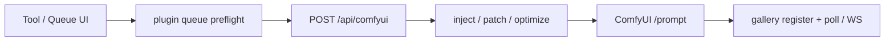

# Architecture

Contributor map of how Prompt Studio is wired. Product setup and feature lists live in the root [README](../README.md).

## Shape

Next.js App Router under `src/app/`, shared UI in `src/components/`, domain logic in `src/lib/`, hooks in `src/hooks/`.

| Layer | Responsibility |
|-------|----------------|
| **Client** | Tool UIs, Dexie settings/history/workflows/gallery, plugin install, Comfy job register + poll/WebSocket |
| **Server (`src/app/api/**`)** | LLM calls, ComfyUI `/prompt` proxy + inject/preflight, auth/session/ACL, optional JSON under `PROMPT_DATA_DIR` |
| **Edge gate** | `src/proxy.ts` — auth, rate limit, usage log before route handlers |

Shell (`src/app/layout.tsx`) wraps pages with `AuthProvider`, `AppNav`, gallery background poller, and storage sync.

## Persistence

### Browser (primary)

IndexedDB via Dexie — database `comfy-prompt-studio-v1` (`src/lib/app-db.ts`):

- `galleryEntries` — Comfy jobs and outputs
- `kv` — settings, prompt history, workflow library, plugins, projects, etc.

Access: `src/lib/browser-storage.ts`, `src/lib/gallery-db-store.ts`, init `src/lib/app-db-init.ts`. Legacy `localStorage` keys migrate into Dexie on first hydrate. Theme/density stay in `localStorage` for the FOUC script in the root layout.

### Server (optional)

When `PROMPT_DATA_DIR` is set (`src/lib/server-storage.ts`):

- `{PROMPT_DATA_DIR}/{namespace}.json` — namespaces in `src/lib/storage-namespaces.ts`
- Per-user: `{PROMPT_DATA_DIR}/users/{userId}/…` (`src/lib/user-server-storage.ts`)
- Auth: `{PROMPT_AUTH_DIR|PROMPT_DATA_DIR}/auth/users.json`, `groups.json` (`src/lib/auth/store.ts`)
- Analytics snapshots: `auth/analytics-snapshots.json` (client push via `/api/auth/analytics`)

Sync helpers: `src/lib/storage-sync.ts`, `src/lib/auto-storage-sync.ts`, APIs under `src/app/api/storage/**`.

There is no SQLite — server state is JSON files.

## ComfyUI queue path



| Step | Module |
|------|--------|
| Client POST + early WebSocket `clientId` | `src/lib/comfyui-queue-request.ts` |
| Result-panel queue actions | `src/hooks/usePromptResultActions.ts` |
| API entry | `src/app/api/comfyui/route.ts` |
| URL/workflow resolve + queue | `src/lib/comfyui-client.ts` |
| Tokens, inject, loaders, images | `src/lib/comfyui-config.ts` |
| Graph optimize / direct patch | `src/lib/workflow-queue-optimizer.ts`, `src/lib/workflow-direct-patch.ts` |
| Workflow library (Dexie KV) | `src/lib/comfyui-workflow-files.ts` |
| Draft / Final / Max (+ per-tool) | `src/lib/queue-quality-profile.ts`, `src/lib/tool-quality-profiles.ts` |
| Plugin mutators | `src/lib/plugin-queue-hooks.ts` |
| Gallery + progress | `src/lib/comfyui-gallery-client.ts`, `src/lib/comfyui-websocket.ts` |

Related routes: `src/app/api/comfyui/{status,history,view,upload,interrupt,live,…}/`.

## Auth and ACL

Enabled when `PROMPT_AUTH_ENABLED=true` or an existing `users.json` is on disk (`src/lib/auth/config.ts`, `src/lib/auth/store.ts`).

Roles (`src/lib/auth/types.ts`): `admin` | `user` | `viewer`.

- **admin** — all features
- **viewer** — `dashboard`, `gallery`, `studio` only
- **user** — all features minus personal + group `blockedFeatures`

Feature IDs and page/API maps: `src/lib/auth/features.ts` (e.g. `/` → `generate`, `/api/comfyui` → `comfyui-api`, LLM routes → `llm-api`).

Gate path: `src/proxy.ts` → `authorizeAppRequest` (`src/lib/auth/access.ts`). Nav filters by `allowedFeatures` from `/api/auth/session` (`src/hooks/useAuth.tsx`, `src/components/AppNav.tsx`).

Session cookie `prompt-studio-session`; also Bearer / `x-prompt-api-token` / per-user API keys.

## Plugins

Installable manifests live in the client settings cache (Dexie), not on the server filesystem (`src/lib/plugin-manifest.ts`).

```ts
{
  id, label, version, enabled?,
  nav?: [{ href, label, description }],
  queueHooks?: { url, events },  // e.g. "queue-preflight"
  tools?: [{ id, title, iframeUrl?, route? }]
}
```

- Nav merges into the sidebar catalog
- Queue hooks run via `runPluginQueuePreflight` before Comfy queue
- Custom tools render at `/plugins/[id]` (`src/app/plugins/[id]/page.tsx`)

Bookmarks (non-manifest) are separate: `src/lib/tool-plugin-registry.ts`. Example hook: `src/app/api/plugin-hooks/denoise-rewrite/route.ts`.

## LLM and vision

| Concern | Where |
|---------|--------|
| Chat / vision client | `src/lib/llm-client.ts` |
| Env helpers | `src/lib/llm-env.ts` |
| Vision downscale/recompress before model | `src/lib/vision-image-prepare.ts` |
| Generate / format / refine | `/api/generate`, `/api/format`, `/api/refine` (+ tool-specific routes) |

LLM routes are gated as `llm-api` when auth is on. Prompt cleanup / thinking-artifact stripping lives in `src/lib/prompt-cleanup.ts`.

## Env categories

See `.env.example` for the full list. Groups that matter for architecture:

| Category | Examples |
|----------|----------|
| LLM | `LLM_ENABLED`, `LLM_API_BASE_URL`, `LLM_MODEL`, `LLM_VISION_MODEL` |
| ComfyUI | `COMFYUI_API_URL`, `COMFYUI_POOL`, `COMFYUI_ALLOW_CLIENT_URL`, `COMFYUI_ROOT` |
| Auth | `PROMPT_AUTH_ENABLED`, `PROMPT_ADMIN_*`, `PROMPT_SESSION_SECRET`, `PROMPT_API_TOKEN` |
| Persistence | `PROMPT_DATA_DIR`, `PROMPT_AUTH_DIR` |
| Ops | `API_RATE_LIMIT_*`, scheduled batch / maintenance flags |

## Where to look next

| Question | Start here |
|----------|------------|
| Why did queue change my graph? | `comfyui-config.ts`, `workflow-queue-optimizer.ts`, Settings → workflow takeover |
| Where did this setting go? | Dexie `kv` via `browser-storage.ts` / `settings-cache` |
| Why is a nav item missing? | `auth/features.ts` + user/group `blockedFeatures` |
| Why did a plugin alter queue? | `plugin-queue-hooks.ts` + installed manifests |
| Refine / vision blew up? | `vision-image-prepare.ts`, `llm-client.ts`, `/api/refine` |
